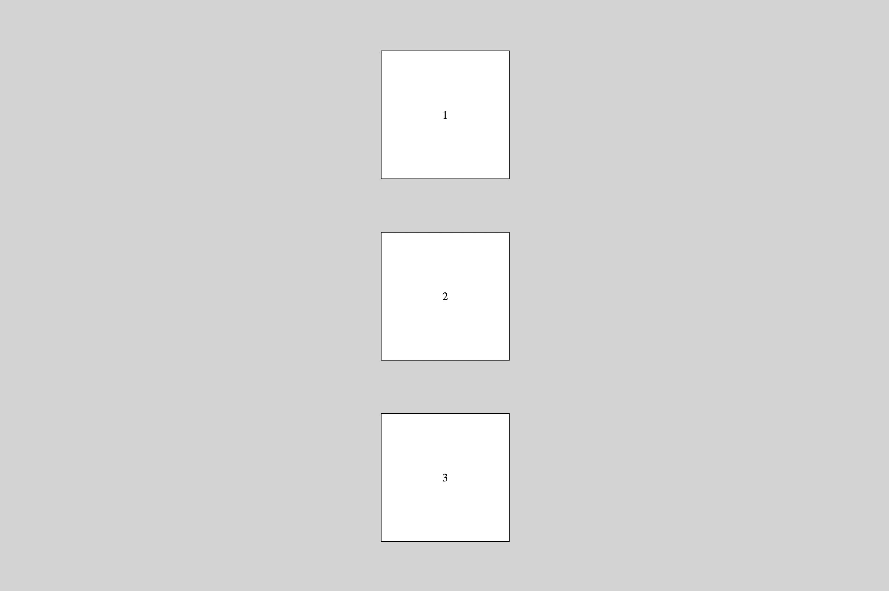

Altere o arquivo CSS para deixar o HTML como na imagem abaixo. Para isso utilize as propriedades justify-content, align-items e flex-direction.

Dica: Lembre-se que itens flex também podem ser contêineres.

