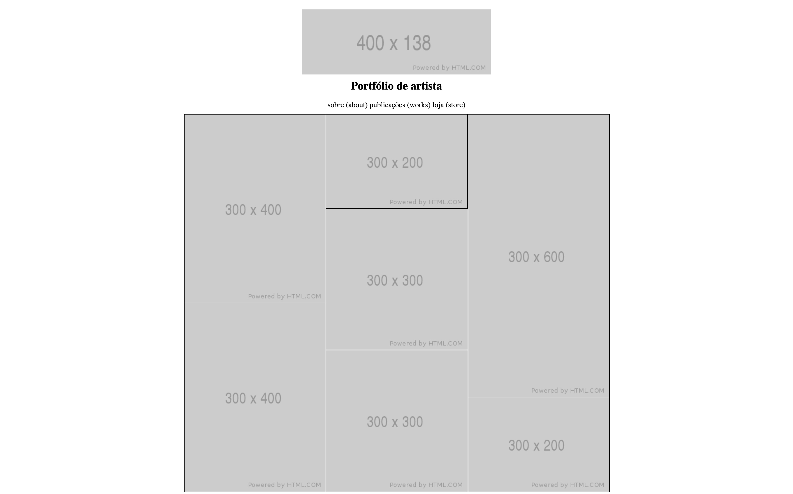

Grid - Exercícios
Setup do projeto no Git
Siga esses passos pra fazer o setup e poder trabalhar no seu projeto:

 Crie um fork deste projeto.
Esqueceu como se faz?
 Clone sua PRÓPRIA versão do repositório
Esqueceu como se faz?
 Crie uma nova branch: git checkout -b <turma-nome-sobrenome-s024>.
Entenda o comando `git checkout -b`
 Implemente o projeto na branch <turma-nome-sobrenome-s024>. Lembre-se de fazer commits.
 Dê push nos commits: git push origin <turma-nome-sobrenome-s024>.
Siga os passos abaixo ao terminar seu projeto, para enviá-lo:

 Envie um Pull Request da sua branch recém enviada, para que seja possível fazer o merge depois. POR FAVOR NAO FAÇA O MERGE DO SEU PRÓPRIO PULL REQUEST
 Após o momento de feedback e correção, aprove seu Pull Request e faça o merge
 Seu projeto será considerado completo quando a aprovação e o merge com a main acontecerem em seu próprio repositório.
Como eu vou executar os exercícios?
Desta vez todos os arquivos .md com o enunciado estão na pasta raíz do repositório, pois iremos utilizar os mesmos arquivos .html e .css. Dessa vez, você pode alterar tanto o arquivo HTML quanto o arquivo CSS, e ver o resultado acessando o arquivo. No seu navegador de internet (sugerimos o Google Chrome). Para acessar o arquivo, você pode copiar o caminho dele e colar no navegador, ou utilizar a extensão LiveServer. Mais detalhes sobre a extensão no material assíncrono. Além disso, você pode utilizar o Chrome DevTools para entender como estão as propriedades dos elementos do seu projeto.

O que você precisa saber e praticar desta aula?
 item 1 - grid-template
 item 2 - justify-items e align-items
 item 3 - grid-row e grid-column
Ao terminar o exercício, você deverá ter algo parecido com isso:   

